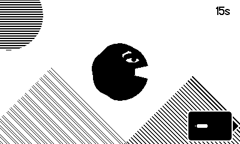

# Crank Tomato

A crank based game for the [Playdate video game console](https://play.date/).

## Gameplay

You play a large, hungry blob that gobbles up tomatoes flying in from every angle. Rotate your character with the Playdate crank and eat as many tomatoes as you can within the time limit!

## Contributing

You'll need the Playdate SDK and simulator. Additionally, the Nova Editor from PANIC makes the process easier. Learn more on the [panic website](https://play.date/dev/).
